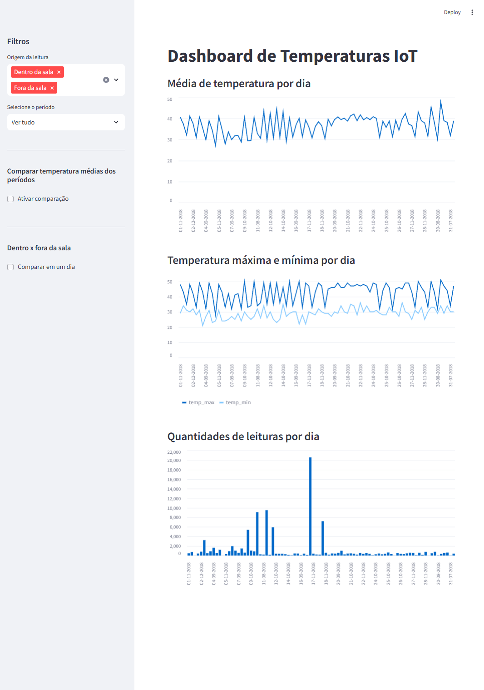
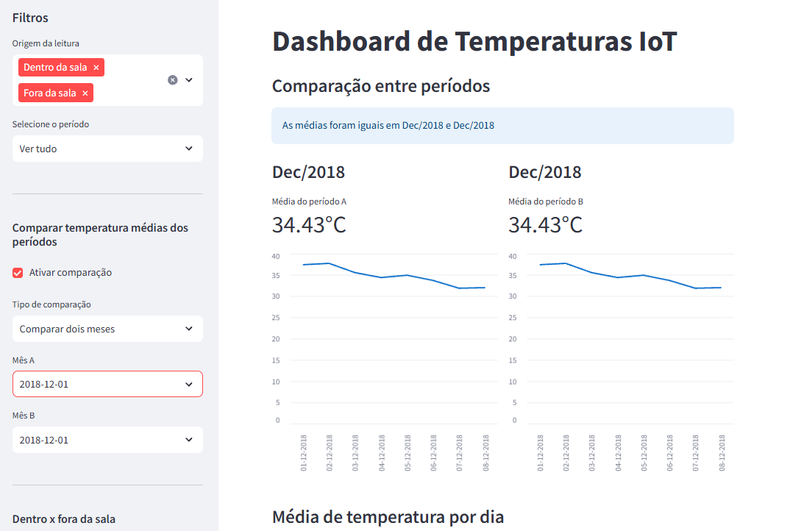
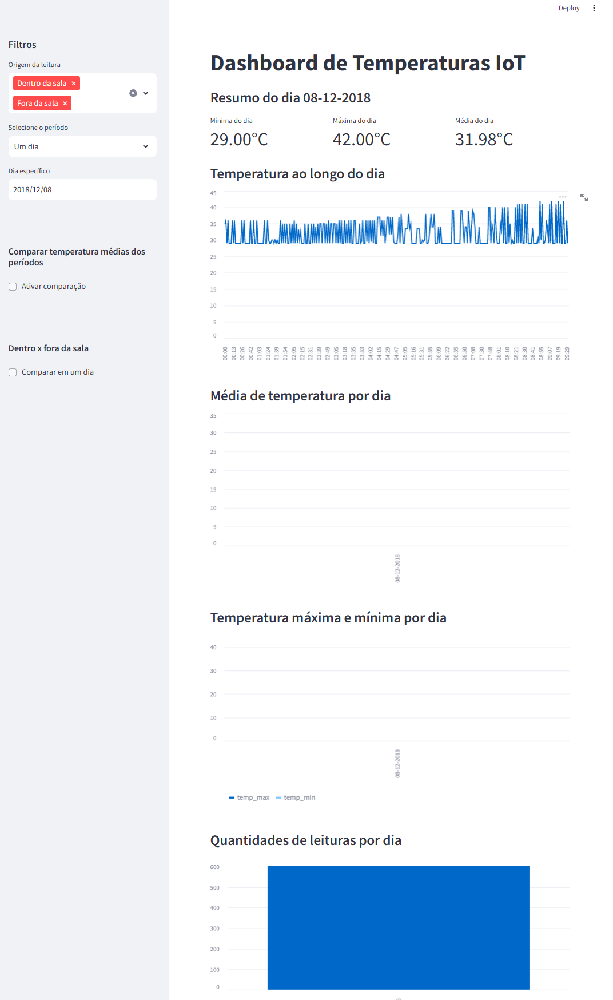

# Pipeline IoT — Monitoramento de Temperatura

Pipeline de dados educacional para leituras de sensores IoT. O projeto importa um CSV, normaliza e persiste as leituras no PostgreSQL e disponibiliza um dashboard Streamlit para exploração temporal das temperaturas.

O conjunto de dados usado no exemplo é o [Temperature Readings: IoT Devices](https://www.kaggle.com/datasets/atulanandjha/temperature-readings-iot-devices).

## Arquitetura

```text
Dashboard (Streamlit)
        │
        ▼
Services
        │
        ▼
Repositories
        │
        ▼
PostgreSQL
```

- `src/dashboard.py`: interface Streamlit e componentes visuais; não executa SQL nem acessa o banco diretamente.
- `src/services/temperature_service.py`: casos de uso, validação/limpeza do CSV, filtros e comparação de períodos.
- `src/repositories/temperature_repository.py`: único local com consultas SQL, criação de schema, views e persistência.
- `src/db_connection.py`: configuração e criação reutilizável da conexão PostgreSQL.
- `src/models.py`: definição SQLAlchemy da tabela `temperature_readings`.
- `src/ingest_csv.py`: ponto de entrada de linha de comando que delega a ingestão ao service.

## Estrutura

```text
Pipeline-IOT/
├── data/temperature_readings.csv
├── src/
│   ├── create_views.sql
│   ├── dashboard.py
│   ├── db_connection.py
│   ├── ingest_csv.py
│   ├── models.py
│   ├── repositories/
│   │   └── temperature_repository.py
│   └── services/
│       └── temperature_service.py
├── .env.example
├── docker-compose.yml
├── Dockerfile
└── requirements.txt
```

## Requisitos

- Docker Desktop com Docker Compose; ou
- Python 3.10+ e uma instância PostgreSQL 15+.

## Execução com Docker

Opcionalmente, copie `.env.example` para `.env` e altere as credenciais. Não versione esse arquivo.

```bash
docker compose up --build
```

O dashboard estará em [http://localhost:8501](http://localhost:8501). O Compose cria o banco e, após o PostgreSQL estar saudável, executa a ingestão e inicia o Streamlit.

Para parar os serviços:

```bash
docker compose down
```

Para também apagar o volume do PostgreSQL:

```bash
docker compose down -v
```

## Execução local

Crie e ative um ambiente virtual, instale as dependências e configure as variáveis de banco. No PowerShell:

```powershell
python -m venv .venv
.\.venv\Scripts\Activate.ps1
pip install -r requirements.txt
```

Use `.env.example` como referência. Em execução local, `DB_HOST` deve apontar para o seu PostgreSQL, normalmente `localhost`.

```powershell
$env:DB_USER="iot_user"
$env:DB_PASSWORD="iot_password"
$env:DB_NAME="iot_db"
python src/ingest_csv.py
streamlit run src/dashboard.py
```

## Funcionalidades

- Filtros para toda a base, último mês, última semana e um dia específico.
- Médias, máximas, mínimas e volume de leituras por dia.
- Resumo e série intradiária para um único dia.
- Comparação de médias entre dois meses, semanas ou dias.

## Dados e atualização

O CSV deve conter `id`, `room_id/id`, `noted_date`, `temp` e `out/in`. A ingestão converte os nomes para o padrão do banco, descarta registros incompletos e evita duplicidade pelo campo `id`.

Para carregar novos dados no CSV, execute novamente:

```bash
python src/ingest_csv.py
```

As views são recriadas quando o dashboard inicia. No Docker, reinicie o serviço `dashboard` após uma carga manual para renovar a interface.

## Screenshots

Os screenshots serão adicionados posteriormente. Quando estiverem prontos, salve-os, por exemplo, em `docs/images/` e substitua os links abaixo:

```markdown



```

## Observações de desenvolvimento

As credenciais padrão existem apenas para facilitar a execução local. Para qualquer ambiente compartilhado ou de produção, defina uma senha forte em `.env` ou em um gerenciador de segredos e não exponha a porta do banco sem necessidade.
